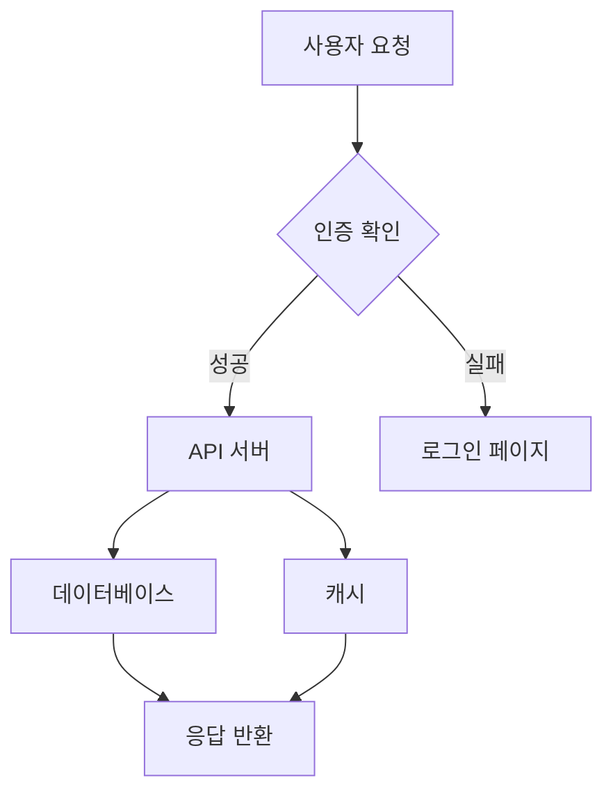
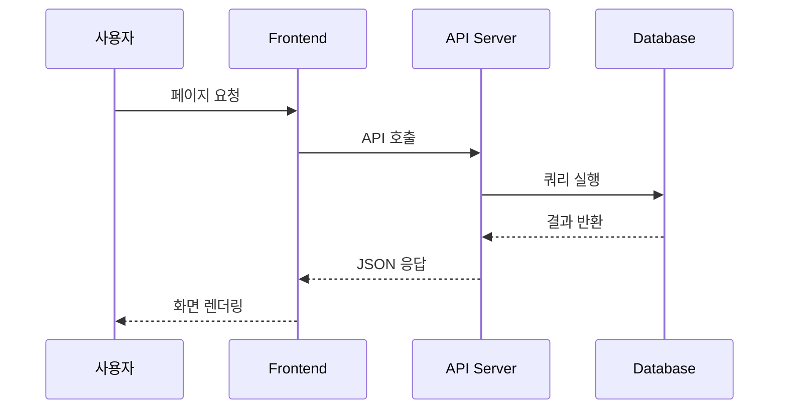

이 포스트에서는 블로그에서 사용할 수 있는 다이어그램 작성 방법을 소개합니다.

## Mermaid.js 다이어그램

포스트 front matter에 `mermaid: true`를 추가하면 Mermaid 다이어그램을 사용할 수 있습니다.

### Flowchart



### Sequence Diagram



### Hand-drawn 스타일

이 포스트는 front matter에 `mermaid_look: handDrawn`을 설정했기 때문에 모든 다이어그램이 손으로 그린 듯한 스타일로 렌더링됩니다.

클래식 스타일을 원하면 `mermaid_look: classic`으로 변경하거나 해당 설정을 제거하면 됩니다.

### 사용 가능한 테마

| front matter | 설명 |
|---|---|
| `mermaid_theme: default` | 기본 테마 |
| `mermaid_theme: dark` | 다크 테마 |
| `mermaid_theme: forest` | 녹색 계열 테마 |
| `mermaid_theme: neutral` | 흑백 중심 테마 |
| `mermaid_look: handDrawn` | Excalidraw 스타일 hand-drawn |

## Excalidraw SVG 임베딩

[Excalidraw](https://excalidraw.com/)에서 다이어그램을 그린 뒤 SVG로 내보내기 하고, `assets/diagrams/` 폴더에 저장합니다.

포스트에서 include로 삽입합니다:

```liquid

```

### Excalidraw 사용 팁

1. [excalidraw.com](https://excalidraw.com/)에서 다이어그램을 그립니다
2. 메뉴 → Export → SVG 형식으로 내보냅니다
3. "Background" 체크를 해제하면 투명 배경으로 내보낼 수 있습니다
4. 파일을 `assets/diagrams/` 폴더에 저장합니다
5. 포스트에서 ``로 삽입합니다
