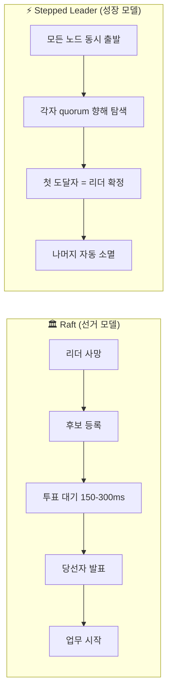
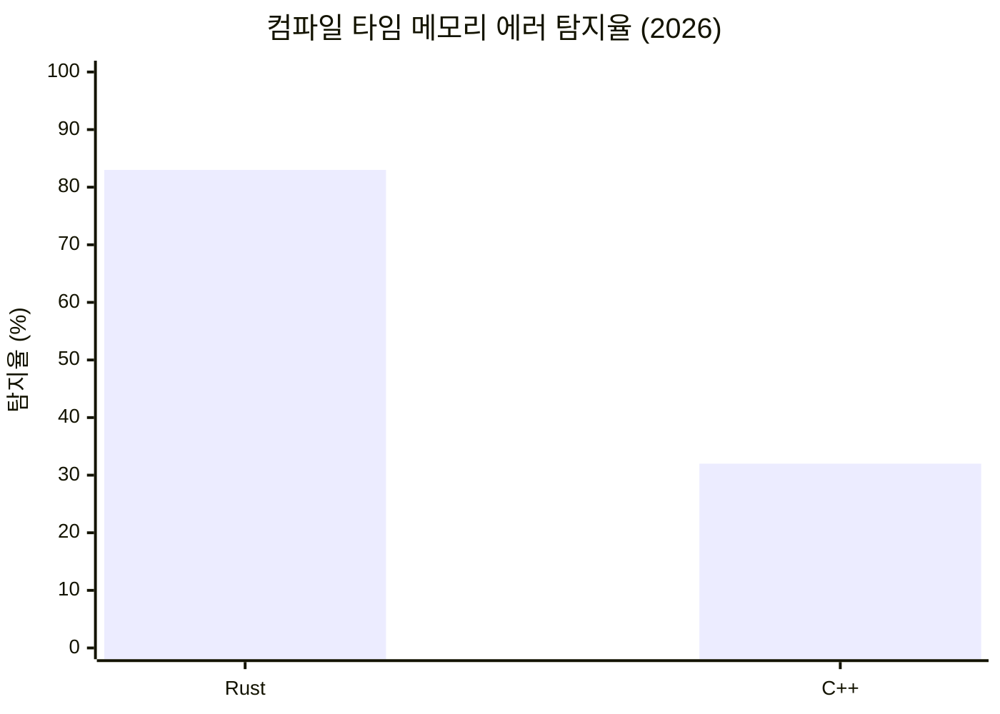
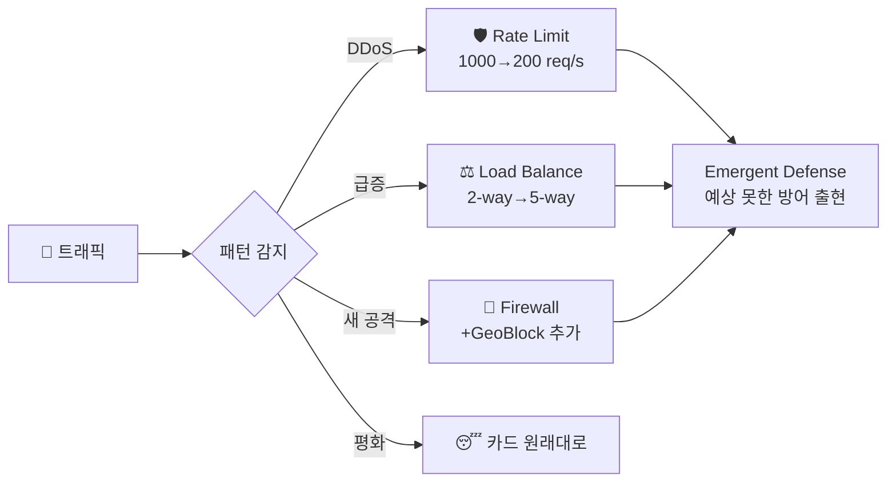

한 달 전, 나는 AI에게 크론잡을 하나 걸었다.

> 매일 오전 11시, 오후 5시 — 폭넓은 IT 트렌드와 전혀 다른 분야(자연과학, 예술, 역사, 스포츠…)를 **강제 충돌**시켜라. 에코 챔버를 탈출하라. 이전 아이디어를 기반으로 진화시켜라.

이름은 **"창의성 폭발"**. Discord 채널에 하루 2번 자동으로 쏜다. 한 달이 지났다.

결과: **70개 넘는 씨앗**이 쌓였다. 번개에서 분산 시스템을 배우고, 사워도우에서 데이터베이스를 설계하고, 문어 팔에서 CPU 캐시를 최적화하고, 킨츠기에서 코드 리팩터링 전략을 훔쳤다.

이 글에서는 그중 **"재미 지수" 기준**으로 뽑은 TOP 3을 소개한다. 실용성? 나중에 생각하자. 읽었을 때 머릿속에서 불꽃이 튀는지가 기준이다.

---

## 1. ⚡ 번개가 분산 시스템보다 똑똑하다

### "리더는 뽑히지 않고 자라난다"

분산 시스템을 공부해본 사람이라면 **Raft**라는 합의 알고리즘을 알 거다. 여러 서버가 "누가 리더냐"를 정하는 프로토콜인데, 핵심 흐름이 이렇다:

1. 리더가 죽는다
2. 후보들이 "나 뽑아줘" 메시지를 보낸다
3. 과반수 투표를 받으면 새 리더가 된다
4. **이 과정 동안 (150~300ms) 시스템은 멈춰 있다**

민주주의적이고 우아하다. 근데 자연은 이렇게 안 한다.

### 번개는 선거를 안 한다

번개가 치기 0.001초 전, 눈에 보이지 않는 일이 벌어진다.

구름에서 **stepped leader**라는 투명한 가지 수십 개가 **동시에** 사방으로 뻗어나간다. 각 가지는 공기를 이온화하면서 지면을 향해 경로를 탐색한다. 그리고 **가장 먼저 지면에 닿는 가지 하나**가 결정되는 순간 —

**Return stroke.** 에너지의 99.9%가 그 하나의 경로로 역방향 폭발한다. 우리가 보는 번개는 이 순간이다.

나머지 가지들? **그냥 소멸한다.** 투표도 없고, 항의도 없다.


*실제 번개 사진: 여러 갈래가 동시에 탐색하고, 가장 먼저 도달한 경로 하나로 에너지가 집중된다.*


### 이걸 분산 시스템에 적용하면?

Raft는 **"먼저 리더를 뽑고 → 일을 시킨다"**. 번개는 **"모두 동시에 일을 시작하고 → 먼저 끝낸 놈이 리더가 된다"**.




*Raft 합의 시각화: 노드들이 투표를 통해 리더를 선출하는 과정. 이 "선거"를 번개의 자연 선택으로 바꾸면?*

이건 완전히 공상은 아니다. **투기적 실행(speculative execution)**은 이미 CPU 파이프라인과 데이터베이스에서 검증된 개념이고, **EPaxos** 같은 리더 없는 합의 프로토콜이 이미 존재한다.

### 이 비유가 깨지는 지점

번개에서 "진 가지"는 그냥 사라진다. 자연에선 에너지 낭비해도 괜찮으니까. 근데 분산 시스템에서 N개 노드가 동시에 쓰기를 시도하면? **충돌 해소 비용이 폭발한다.** 특히 쓰기가 빈번한 워크로드에서는 "진 가지들의 롤백 비용"이 선거 대기 시간보다 더 클 수 있다.

**비유가 가장 아름다운 지점(동시 탐색)이 가장 비싼 지점(동시 충돌)이기도 하다.** 이 긴장이 오히려 흥미롭다.

> "리더는 뽑히지 않고 자라난다."
>
> — 이 한 줄이 머릿속에 남으면 이 아이디어는 성공이다.

---

## 2. 🧠 Rust가 안전한 진짜 이유는 행동경제학이다

### Borrow Checker = 넛지

Rust가 왜 안전한지 물으면 보통 이런 답이 돌아온다: "소유권 모델", "affine type system", "borrow checker가 컴파일 타임에 메모리 안전을 보장". 전부 맞는 말이다.

근데 나는 다른 각도에서 보고 싶다. **왜 개발자가 Rust로 짤 때 더 신중해지는가?** 타입 시스템이 강제해서? 물론. 근데 그게 전부일까?

### C vs Rust — 코드 한 줄의 심리학

C에서 포인터를 복사하면 이런 일이 벌어진다:

```c
char* a = data;
char* b = a;    // a도 살아있고, b도 살아있다
// → "잃을 게 없어 보인다" → 방만하게 공유
free(a);        // b는? 💀 use-after-free
```

Rust에서 같은 일을 하면:

```rust
let a = data;
let b = a;      // a는 이 순간 죽는다 ⚰️
println!("{}", a);  // 컴파일 에러! a는 이미 없다
```

**`let b = a;`를 쓰는 순간, a가 사라진다.**


*카너먼의 가치 함수: 손실(왼쪽 아래)이 이득(오른쪽 위)보다 훨씬 가파르다. Rust의 move semantics는 개발자를 이 손실 영역에 놓는다.*

### 카너먼의 손실 회피 (Loss Aversion)

노벨 경제학상을 받은 대니얼 카너먼의 핵심 발견: **손실은 동일한 크기의 이득보다 2배 아프다.** 10만원을 잃는 고통이 10만원을 버는 기쁨보다 훨씬 크다. 이게 인간의 기본 설정이다.

Rust의 move semantics는 매 순간 이 심리를 건드린다:

- `a`를 `b`에 넘기면 → **`a`를 잃는다** → 손실 회피 발동
- "정말 넘겨야 하나?" → **2배 더 신중한 설계**
- 결과: 데이터 흐름을 훨씬 더 꼼꼼하게 생각하게 됨

C에서는? 포인터 복사해도 원본이 살아있으니 **"잃을 게 없어 보인다"**. 심리적 브레이크가 안 걸린다.

2026년 벤치마크에서 Rust의 정적 분석이 메모리 에러의 **83%**를 컴파일 전에 잡아낸다. C++은 **32%**. 이 51%p 차이가 순전히 타입 시스템 때문일까? 아니면 **개발자의 심리적 행동 변화**도 한몫 하는 걸까?


*51%p 차이 — 타입 시스템만으로 설명할 수 있을까?*

### 이 주장이 깨지는 지점

솔직히 말하면, **인과관계 vs 상관관계**가 가장 큰 약점이다. Rust 개발자가 더 신중한 이유가 "잃기 싫어서"인지, 단순히 "컴파일이 안 되니까 강제로 고치는 것"인지 구분하기 어렵다. Rust를 처음 배울 때 borrow checker와 싸우는 경험은 "손실 회피"보다 "좌절"에 더 가깝기도 하고.

하지만 흥미로운 건, **Cognitive Dimensions of Notations**라는 학문이 이미 프로그래밍 언어 설계의 인지적 영향을 연구하고 있다는 점이다. "borrow checker가 넛지로 작동한다"는 가설은 실험 설계가 가능하다. Rust 개발자와 C++ 개발자에게 동일한 문제를 주고, **설계 시간과 의사결정 패턴**을 비교하면 된다.

> Borrow checker는 타입 시스템인 동시에 행동경제학 넛지다.
>
> — 증명되진 않았지만, 이 프레임으로 Rust를 바라보면 세상이 달라 보인다.

---

## 3. 🎮 니 네트워크는 덱인데, 카드를 한 번도 안 바꿨어

### 로그라이크 × eBPF = 자기 진화 네트워크

2026년 로그라이크 덱빌더 게임의 혁신: 카드를 **쓰는** 게 아니라 카드 **텍스트 자체를 수정**한다. "3 데미지"의 3을 7로 바꾸고, "데미지"를 "힐"로 바꾼다. 게임을 하면 할수록 덱이 변이한다.

한편 **eBPF**라는 기술이 있다. 리눅스 커널을 재시작하지 않고 네트워크 동작을 런타임에 바꿀 수 있는 기술이다. 방화벽 규칙, 로드밸런싱, 모니터링 — 전부 eBPF로 핫스왑 가능하다. Cilium, Cloudflare, Meta가 프로덕션에서 쓰고 있다.


*Slay the Spire의 카드 강화: "중독 2 부여" → "중독 3 부여"로 카드 텍스트 자체가 변이한다. eBPF 규칙도 이렇게 되면?*

**eBPF는 이미 "카드 텍스트를 런타임에 수정"하고 있다.** 근데 지금은 **사람이 카드를 써주는 방식**이다. 엔지니어가 규칙을 작성하고, 로드하고, 모니터링한다. 로그라이크로 치면 "미리 짠 덱으로 플레이" — 그건 체스지 로그라이크가 아니다.


### Self-Mutating Rule Deck

제안: **트래픽 패턴이 eBPF 프로그램의 파라미터를 자동으로 변이**시키는 아키텍처.



게임 이벤트처럼 트래픽이 카드를 변이시킨다:

- **DDoS 웨이브** → rate-limit 카드의 임계값이 자동으로 내려감 (1000→200)
- **트래픽 스파이크** → load-balance 카드가 2-way에서 5-way로 자동 분할
- **새로운 공격 패턴** → 기존 카드들이 **체이닝**되면서 새 방어 조합이 출현
- **평화로운 시간** → 카드들이 원래 상태로 복귀

카드끼리 자동 연결되면서 **엔지니어가 설계하지 않은 방어 전략이 출현(emergence)**하는 것 — 이게 로그라이크 네트워킹의 핵심이다.

### "게임 오버 → 재시작" vs "장애 → 재앙"

이 비유가 깨지는 치명적 지점이 하나 있다. 로그라이크에서 나쁜 카드 변이는 **"게임 오버 → 재시작"**이지만, 프로덕션 네트워크에서 나쁜 변이는 **장애**다.

카드가 스스로 "rate-limit 0"으로 변이하면? 방어 규칙끼리 체이닝되면서 정상 트래픽을 차단하면? 이건 "덱에 저주 카드가 섞였는데 제거 불가"인 상황이다.

해결책도 게임에서 빌려올 수 있다:


*세이브 크리스탈에 덱 상태를 저장한다. 변이가 잘못되면? 여기로 돌아오면 된다.*

- **💾 세이브 포인트**: 변이 전 상태를 항상 저장, 원클릭 롤백
- **변이 범위 제한**: 카드 텍스트를 ±30%까지만 수정 가능
- **덱 슬롯 상한**: 동시에 활성화되는 카드 수 제한
- **변이 이력 로그**: 어떤 트래픽이 어떤 변이를 일으켰는지 전부 기록

**비유의 구멍을 비유 안에서 해결할 수 있다** — 이게 좋은 이종교배의 증거다.

> "니 네트워크 규칙은 덱인데, 카드를 한 번도 안 바꿨어."
>
> — `bpftool prog list` 결과가 3개월 전이랑 똑같으면, 니 덱은 죽어있는 거다.

---


*실제 Discord 채널의 모습. Atlas 봇이 매일 오전/오후 자동으로 이종교배 아이디어를 쏜다.*

## 창의성 폭발이 나에게 가르쳐준 것

한 달간 70개 씨앗을 만들면서 깨달은 게 있다.

**좋은 이종교배는 비유가 깨지는 지점이 있다.** 번개의 동시 탐색은 충돌 비용 문제가 있고, 손실 회피 주장은 인과 증명이 안 되고, self-mutating 카드는 장애를 만들 수 있다. 근데 **깨지는 지점이 오히려 다음 아이디어를 부른다.** 충돌 비용 → "그러면 write-light 워크로드에서만 적용하면?" → 새 씨앗. 인과 증명 → "실험 설계해보면?" → 새 씨앗. 장애 가능성 → "세이브 포인트" → 비유 안에서 답이 나옴.

**아이디어는 맞거나 틀리는 게 아니다. 다음 아이디어를 부르느냐 마느냐가 기준이다.**

이 세 개 중에 진짜 만들어지는 게 있을까? 모르겠다. 근데 이걸 읽고 "와 이거 미쳤다"를 한 번이라도 느꼈다면, 나는 그걸로 충분하다. 미친 생각이 미친 물건이 되는 건 그다음 일이니까.

